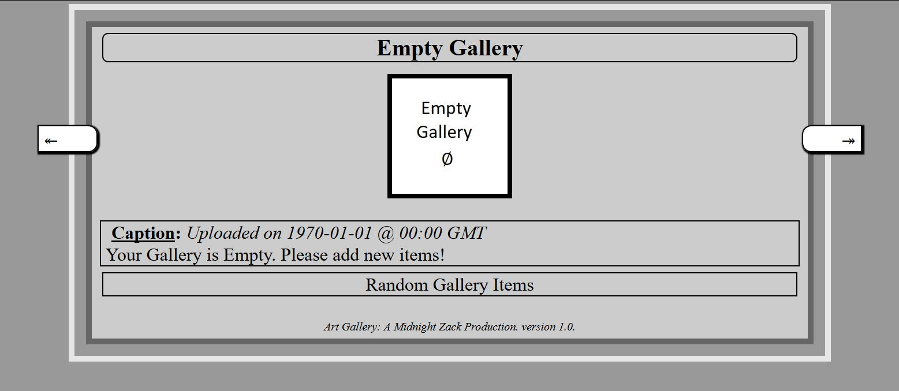
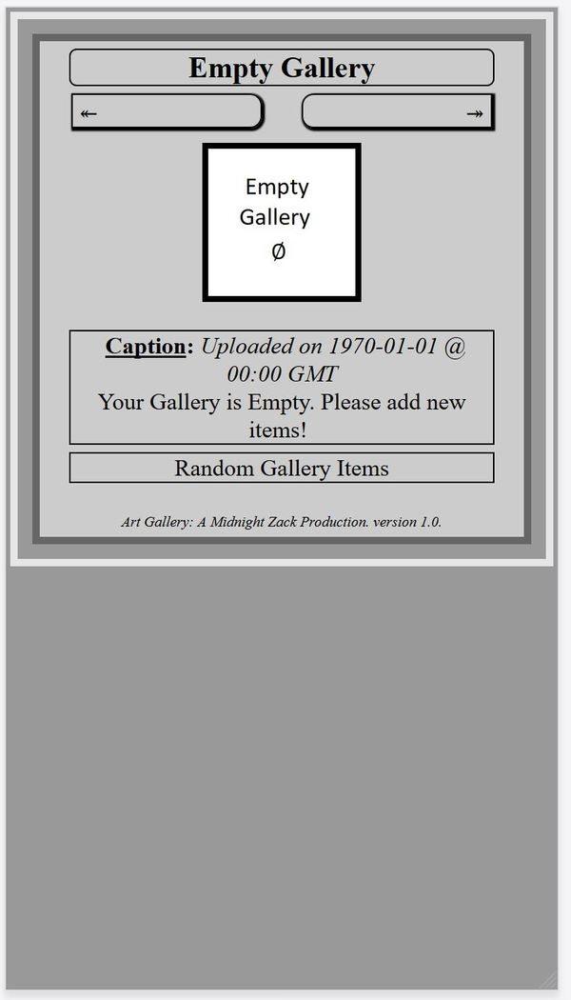
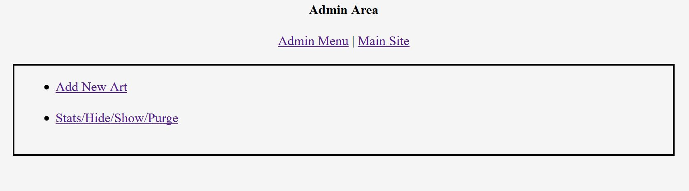

<!-- START doctoc generated TOC please keep comment here to allow auto update -->
<!-- DON'T EDIT THIS SECTION, INSTEAD RE-RUN doctoc TO UPDATE -->
**Table of Contents**  *generated with [DocToc](https://github.com/thlorenz/doctoc)*

- [Project: artgallery](#project-artgallery)
  - [General Description](#general-description)
  - [Requirements and Dependencies](#requirements-and-dependencies)
  - [Instructions](#instructions)
  - [Some Features](#some-features)
  - [ScreenShots](#screenshots)
    - [First Run (Empty Gallery)](#first-run-empty-gallery)
  - [TroubleShooting](#troubleshooting)
    - [Q: Internal Server Error when accessing `/adminup/test_run.php`](#q-internal-server-error-when-accessing-adminuptest_runphp)
    - [Q: I see an Array dump (texts on top of the page)](#q-i-see-an-array-dump-texts-on-top-of-the-page)
    - [Q: I am unable to upload pictures to the gallery through admin panel.](#q-i-am-unable-to-upload-pictures-to-the-gallery-through-admin-panel)
  - [Credit -- Tester and Feature Requester](#credit----tester-and-feature-requester)

<!-- END doctoc generated TOC please keep comment here to allow auto update -->

# Project: artgallery

## General Description
This is a very simple Art Gallery application/website written in `PHP`. 
It allows users to show their art (captured as an image). 

## Requirements and Dependencies
- A webserver capable of running PHP,
- `shell_exec` and `exec` need to be enabled for `PHP`
- `imagick` tool installed (for the use of `convert` tool),
- `wget` needs to be available
- `SQLite3`
- `Jquery` (included in this release)
- `SweetAlert` (incluced in this release). [SweetAlert 2 GitHub](https://sweetalert2.github.io/).

## Instructions 
1. Checkout or Download the project to your webHost
2. Edit the `/appConst.php` file:
	1. For security reason, make sure to change the default values of `DB_LOCATION`, `DB_NAME`
	2. For security reason, change the admin folder name (Default is `/adminup`)
	3. Create an `.htaccess` file in the admin folder rendering said folder accessible to authorized users only
     [Please Read more here](https://www.htaccesstools.com/articles/password-protection/)
3. Access the file `/adminup/test_run.php` through your browser. If everything has been set properly, you 
will not see any error message. 
4. Make sure to set `DEV` global constant to false in `/appConst.php`. You can choose to edit other Global variables.
    1. set `SHOW_RAND_GALLERY` to `true` or `false` if you would like a gallery of random items to show. 
    2. `MAX_RAND_GALLERY` is the number of random items to be shown when `SHOW_RAND_GALLERY` is set to true.
    3. `GALLERY_ACCESS_CODE` set this code to anything if you would like a code to be provided before visitors can see your art. 
5. Enjoy :). To Add/Edit/Hide/Show/Purge items into/from your gallery, access the admin page
6. You might want to Edit the style sheet in `index.php` to customize the Gallery to your liking. 

## Some Features
1. Light weight `< 1 MB`.
2. Your Gallery can be rearranged by dragging and dropping the uploaded items in any order you want. 
3. You can pick which items to show and/or hide. 
4. You can make your gallery accessible only to visitors with a particular token.
5. Navigate Gallery with `Right` and `Left` keyboard keys.

## ScreenShots
### First Run (Empty Gallery)
**Screenshot (no item in gallery)**

**Mobile version screenshot**

**Admin Screenshot**

## TroubleShooting
### Q: Internal Server Error when accessing `/adminup/test_run.php`
**A**: This happens because you might have not set up your `.htaccess` file properly. Make sure the `.htaccess 
has the full path to the .htpasswd file as in:
`AuthUserFile /full/file/path/.htpasswd` 

### Q: I see an Array dump (texts on top of the page)
**A**: `DEV` constant in ``appConst.php`` is probably set to `true`. Set that value to `false.

### Q: I am unable to upload pictures to the gallery through admin panel.
**A**: Make sure of the followings
1. `apache` has write access to the imgs folder
2. the file size in `php.ini` is not too small

## Credit -- Tester and Feature Requester 
[Samuel Khuvis](https://github.com/khsa1)

